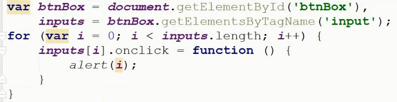
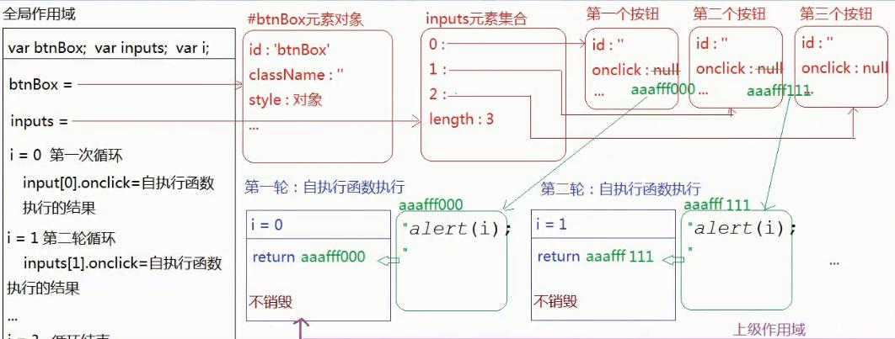
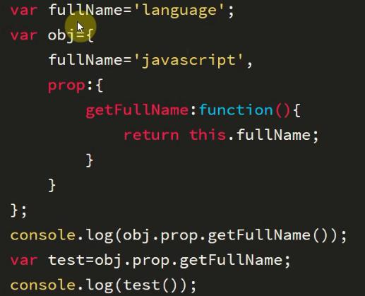
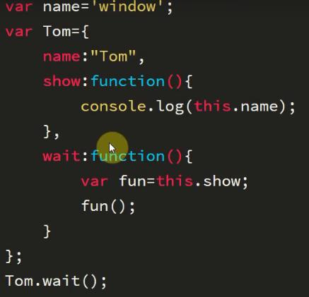

# 面试题

1. 为啥不能分别打印i?
事件绑定是**异步编程** 当触发点击行为 绑定的方法执行的时候 外层的循环已经结束 方法执行产生私有作用域 用到的变量i 已经不是私有的变量 按照**作用域链**的查找机制 找到的全局下的i(此时全局的i已经成为循环最后一次的结果3了)
2. 如何解决?
- 自定义属性
arr[i].index = i;
- 闭包
函数套函数
~~~
/**
 * ====利用闭包的机制 把后期需要的索引事先储存到自己的私有作用域中
 * === 闭包有保存作用
 */
for(var i=0;i<inputs.length;i++){
	inpouts[i].onclick=(function(i){
		return function(){
			alert(i)
		}
	})(i)
}
~~~

每一轮循环 都执行自执行函数形成一个私有作用域(不销毁) 里面设定一个私有变量i 让i储存后期需要用到的索引
第一个作用域i=0...
点击触发方法执行 用到变量i 相对应的上级作用于(没有销毁的那个) 而上级作用域中存储的i的值就是我们需要的索引

这种基于闭包解决问题的方法 非常占用内存

- es6
let代替var
es6和闭包机制类似 es6中使用let创建变量 会形成块级作用域 当前案例中 每一轮循环都会有一个自己的块级作用域 把后续需要用到的索引i事先存储到自己的作用域中

## 2

~~~/**
 * 1.元素绑定事件 方法中的this是当前操作的元素
 * 2.方法名前面有点 点前面是谁this就指向谁 没有的话this就是指向window(严格模式下this是undefined)
 * 3.构造函数执行 方法体中的this是当前类的一个实例
 * 你以为你以为的就是你以为的
 */
~~~

