# HTML

## 常见浏览器有哪些？
>浏览器是网页显示、运行的平台，常见的浏览器有IE、火狐（Firefox/FF）、谷歌（Chrome）、Safari、Opera等等，这是五大浏览器。
## 什么是网页？
网页只要是有文字、图像、超链接等元素构成，除了这些还有音频、视频、flash等等。
## 常见浏览器内核有哪些？
>浏览器内核分为两部分：渲染引擎(layout engineer 或者 Rendering Engine)和js引擎。

>渲染引擎负责取得网页上的内容（html/图像）整理信息（css）以及计算网页的显示方式，然后输出到显示器，浏览器内核的不同对于网页语法解释会有所不同，所以渲染的效果也不相同。

>js引擎是解析JavaScript语言，执行js语言来实现网页的动态效果。

>最开始两者并没有区分的很明确，但是后来JS引擎越来越独立，内核就趋向于单单指渲染引擎，常见的内核有四种。
1. Trident(IE内核)
很多双核浏览器其中之一就是Trident，win10的浏览器为Edge用的新内核EdgeHTML(现在也用谷歌的啦)
2. Gecko(ff)
Mozilla Firefox采用的该内核，特点是代码完全公开，开发程度极高
3. webkit（Safari）
苹果公司的浏览器内核就是webkit
4. Chromium/Blink(chrome)
在chromium项目中研发的Blink渲染引擎，内置于Chrome浏览器中Blink是webkit的分支。

## 浏览器前缀

| 浏览器前缀    | 浏览器                                    |
| -------- | -------------------------------------- |
| -webkit- | Google Chrome, Safari, Android Browser |
| -moz-    | Firefox                                |
| -o-      | Opera                                  |
| -ms-     | Internet Explorer, Edge                |
| -khtml-  | Konqueror                              |

## web标准
浏览器内核不同，工作原理解析都不同，显示的就会有差异

### web标准的好处
1. 让web的发展前景更加广阔
2. 内容被更广泛的设备访问
3. 更容易被搜索引擎搜索
4. 降低网站流量费用
5. 网页更容易维护
6. 提高页面浏览速度

### web标准的构成
是w3c和其他标准化组织制定的一系列标准的集合。主要包括三方面结构、表现、行为。
~~~
结构标准：结构用于对网页元素进行整理和分类
表现标准：表现用于设置网页元素的排版、颜色、大小等外观样式。
行为标准：行为是指网页模型的定义及交互的编写
~~~
## 初识HTML
HTML（Hyper Text Markup Language）中文译为超文本标签语言，是用来描述网页的一种语言。所谓超文本，是指它可以加入图片、声音、动画等内容。不仅如此，还可以从一个文件跳转到另一个文件与世界各地的主机文件相连。
+ HTML是超文本标记语言
+ HTML不是一种编程语言，而是一种标记语言
+ 标记语言是一套标记标签
## html标签分类
1. 双标签

`<h1></h1>`
有开始标签有结束标签 结束标签比开始标签多了一个关闭符/

2. 单标签
`<br />`
单标签也被称之为空标签，是指用一个标签符号即可完整的标书某个功能标签。

## 文档类型
`<!DOCTYPE html>
`
告知浏览器我们使用的是什么版本
## 字符集
`<meta charset="UTF-8">`
~~~
uft-8是目前最常用的字符集编码方式，常用的字符集编码法农港城还有gbk和gb2312
gb2312 简单中文包括6763个汉字
BIG5 繁体中文港澳台
GBK 包含全部中文字符 是GB2312的扩展加入了对繁体字的支持兼容GB2312
UTF-8是包含全世界所有国家需要用到的字符
~~~
## html标签语义化
选用合适的标签做合适的事情 例如文章段落用p标签 标题用h1-h6标签
标签语义化为浏览器和搜索引擎服务

1. 利于Seo优化（搜索引擎的爬虫依赖于标记来确定上下文和各个关键字的权重）
2. 在样式丢失的时候 还可以比较好的呈现结构
3. 更好的支持各种终端 例如无障碍阅读和有声小说
4. 利于团队开发和维护 W3C给我们定了一个标准 团队都遵循这个标准的话 代码的差异就会缩小 在开发和维护的时候就可以提高效率

**日常工作怎么遵循标签语义化**
1. 尽量减少使用无意义的标签 例如div
2. 尽量不适用标签本身的css属性 例如 b s font 需要样式的时候 使用css添加
3. 在强调的部分使用strong和em但是样式尽量使用css来描述
4. 表格搭建时 使用thead表格头部tbody表格身体tfoot表格尾部
5. 列表搭建时 使用ul无语列表和ol有序列表dl定义列表
### 为什么要有语义化标签
1. 方便代码的阅读和维护
2. 同时让浏览器和爬虫更好的解析
3. 语义化标签更好的搜索引擎优化
>合适的地方用一个最为合理的标签

>但我们去掉css之后，网页结构依然组织有序，并且有良好的可读性

## 链接标签
`<a href='跳转目标' target='目标窗口弹出方式'>文本或者图像<a />`

>href：用于指定链接目标的url地址，当为标签应用href属性时，它就具有了超链接的功能。  Hypertext Reference的缩写。意思是超文本引用

>target：用于指定链接页面的打开方式，其取值有_self和_blank两种，其中_self为默认值，_blank为在新窗口中打开方式。
## 锚点定位
```
<!--1.使用href='#id名字'-->
<a href="#two">   
<!--2.使用响应的ID名字标注跳转目标的位置-->
<h3 id="two">第2集</h3> 
```
## base标签
base标签可以设置整体连接的打开状态

head标签里面

把所有的链接多碍事默认添加target='_blank'

## 块级元素(block-level)

每个块元素通常都会独自占据一整行或多整行，可以对其设置宽度、高度、对齐等属性，常用于网页布局和网页结构的搭建。

常见的块元素有：
`<h1>~<h6>、<p>、<div>、<ul>、<ol>、<li>`

**块级元素的特点**

1. 总是从新行开始
2. 高度，行高、外边距以及内边距都可以控制。
3. 宽度默认是容器的100%
4. 可以容纳内联元素和其他块元素。

## 行内元素(inline-level)

行内元素（内联元素）不占有独立的区域，仅仅靠自身的字体大小和图像尺寸来支撑结构，一般不可以设置宽度、高度、对齐等属性，常用于控制页面中文本的样式。

> 常见的行内元素有:
`<a>、<strong>、<b>、<em>、<i>、<del>、<s>、<ins>、<u>、<span>`

**行内元素的特点**

1. 和相邻行内元素在一行上。
2. 高、宽无效，但水平方向的padding和margin可以设置，垂直方向的无效。
3. 默认宽度就是它本身内容的宽度。
4. 行内元素只能容纳文本或则其他行内元素。（a特殊）

>  注意：
>
> 1. 只有 文字才 能组成段落  因此 p  里面不能放块级元素，同理还有这些标签h1,h2,h3,h4,h5,h6,dt，他们都是文字类块级标签，里面不能放其他块级元素。
> 2. 链接里面不能再放链接。

## 块级元素和行内元素的区别
~~~
块级元素的特点：
（1）总是从新行开始
（2）高度，行高、外边距以及内边距都可以控制。
（3）宽度默认是容器的100%
（4）可以容纳内联元素和其他块元素。
~~~

~~~
行内元素的特点：
（1）和相邻行内元素在一行上。
（2）高、宽无效，但水平方向的padding和margin可以设置，垂直方向的无效。
（3）默认宽度就是它本身内容的宽度。
（4）行内元素只能容纳文本或则其他行内元素。
~~~

## 行内块元素（inline-block）

~~~
在行内元素中有几个特殊的标签——、<input />、<td>，可以对它们设置宽高和对齐属性，有些资料可能会称它们为行内块元素。
行内块元素的特点：
（1）和相邻行内元素（行内块）在一行上,但是之间会有空白缝隙。
（2）默认宽度就是它本身内容的宽度。
（3）高度，行高、外边距以及内边距都可以控制。
~~~
## 相对路径
>以引用文件所在的位置为参考，建立出的目录路径，当保存于不同目录的网页引用同一个文件时，所使用的路径将不相同，故称之为相对路径。

>绝对路径以Web站点根目录为参考基础的目录路径。之所以称为绝对，意指当所有网页引用同一个文件时，所使用的路径都是一样的。
## 无序列表
```
<ul>
  <li>列表项1</li>
  <li>列表项2</li>
  <li>列表项3</li>
  ......
</ul>
```
## 有序列表
```
<ol>
  <li>列表项1</li>
  <li>列表项2</li>
  <li>列表项3</li>
  ......
</ol>
```
## 自定义列表
```
<dl>
  <dt>名词1</dt>
  <dd>名词1解释1</dd>
  <dd>名词1解释2</dd>
  ...
  <dt>名词2</dt>
  <dd>名词2解释1</dd>
  <dd>名词2解释2</dd>
  ...
</dl>
```
## 表单
~~~
table用于定义一个表格
tr 用于定义表格中的一行，必须嵌套在 table标签中，在 table中包含几对 tr，就有几行表格。
td /td：用于定义表格中的单元格，必须嵌套在<tr></tr>标签中，一对 <tr> </tr>中包含几对<td></td>，就表示该行中有多少列（或多少个单元格）。
~~~
| 属性名      | 含义                                     | 常用属性值                  |
| ----------- | ---------------------------------------- | --------------------------- |
| border      | 设置表格的边框默认border='0'无边框       | 像素                        |
| cellspacing | 设置单元格与单元格边框之间的空白间隙     | 像素默认2像cellpcellpadding |
| cellpadding | 设置单元格内容与单元格边框之间的空白间距 | 默认1像素                   |
| width       | 设置表格的宽度                           | 像素                        |
| height      | 设置表格的高度                           | 像素                        |
| align       | 设置表格在网页上的对齐方式               | left center right 
## 表头标签
>表头一般位于表格的第一行或第一列，其文本加粗居中，如下图所示，即为设置了表头的表格。设置表头非常简单，只需用表头标签&lt;th&gt;</th&gt;替代相应的单元格标签&lt;td&gt;</td&gt;即可。
## 表格标题
caption 元素定义表格标题。

## 合并单元格
>跨行合并：rowspan    跨列合并：colspan
 
## 表单
在我们网页中， 我们也需要跟用户进行交互，收集用户资料，此时需要表单。
~~~
表单控件：
包含了具体的表单功能项，如单行文本输入框、密码输入框、复选框、提交按钮、重置按钮等。
提示信息：
一个表单中通常还需要包含一些说明性的文字，提示用户进行填写和操作。

表单域：  
他相当于一个容器，用来容纳所有的表单控件和提示信息，可以通过他定义处理表单数据所用程序的url地址，以及数据提交到服务器的方法。如果不定义表单域，表单中的数据就无法传送到后台服务器。
~~~
**input控件**
| 属性      | 属性值   | 描述                   |
| --------- | -------- | ---------------------- |
| type      | text     | 单行文本输入框         |
|           | password | 密码输入框             |
|           | radio    | 单选按钮               |
|           | checkbox | 复选按钮               |
|           | button   | 普通按钮               |
|           | submit   | 提交按钮               |
|           | reset    | 重置按钮               |
|           | image    | 图像形式的提交按钮     |
|           | file     | 文件域                 |
| name      | 自定义   | 控件的名字             |
| value     | 自定义   | 默认的文本             |
| size      | 正整数   | 页面显示的宽度         |
| checked   | checked  | 默认被选中项           |
| maxlenght | 正整数   | 控件允许输入的最多字符 |
## label标签
用于绑定一个表单元素, 当点击label标签的时候, 被绑定的表单元素就会获得输入焦点

for 属性规定 label 与哪个表单元素绑定。
```
<label for="male">Male</label>
<input type="radio" name="sex" id="male" value="male">
```
## textarea控件(文本域)
如果需要输入大量的信息，就需要用到&lt;textarea&gt;&lt;/textarea&gt;标签。通过textarea控件可以轻松地创建多行文本输入框，其基本语法格式如下：
```
<textarea cols="每行中的字符数" rows="显示的行数">
  文本内容
</textarea>
```
## 下拉菜单
```
<select>
  <option>选项1</option>
  <option>选项2</option>
  <option>选项3</option>
  ...
</select>
```
1. <select&gt;</select&gt;中至少应包含一对&lt;option></option&gt;。
2. 在option 中定义selected =" selected "时，当前项即为默认选中项。
## 表单域
在HTML中，form标签被用于定义表单域，即创建一个表单，以实现用户信息的收集和传递，form中的所有内容都会被提交给服务器。创建表单的基本语法格式如下：
```
<form action="url地址" method="提交方式" name="表单名称">
  各种表单控件
</form>
```
1. Action
在表单收集到信息后，需要将信息传递给服务器进行处理，action属性用于指定接收并处理表单数据的服务器程序的url地址。
2. method
用于设置表单数据的提交方式，其取值为get或post。
3. name
用于指定表单的名称，以区分同一个页面中的多个表单。


## 块级标签和行内标签的特点?
独占一行和不独占一行可以区分

块级元素 table dl dt dd div h1-h6 hr ul li p nav form
- 与布局相关的大都属于块级 
- 从上往下排列
- 可以设置宽高以及盒子模型的其他属性
- 不设置宽高的情况下 他的宽度是父元素的宽度 高度是本身内容的高度
- 天生自带display：block；
- 块级元素可以嵌套行内元素
- ulol下面只能是li dl下面只能是dt dd
- p里面不能嵌套任何的块级元素 包括他自己本身

行内元素 a img span button em i input select strong b small sub sup textarea
- 与文字相关的大都属于行内 
- 从左往右排列
- 设置宽高不起作用 如果要起作用 需要转换为块、行内块
- 不设置宽高就是他本身的宽高
- 天生自带display：inline；
- 行内元素里不能嵌套块级元素（特殊a）
- a标签不能嵌套a标签 即使嵌套了 浏览器也会解析为并列的两个a

行内块元素
img input


## 新增属性
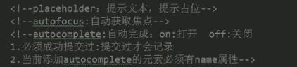  
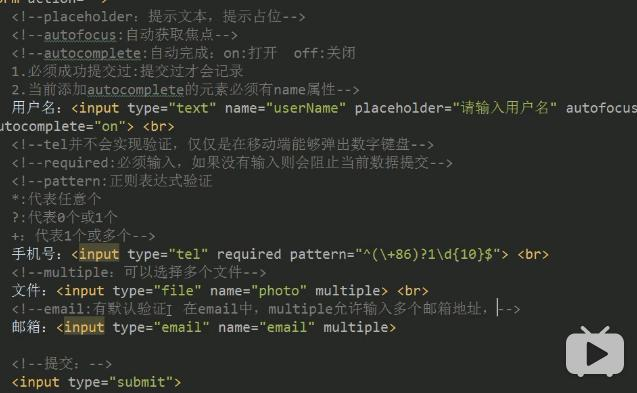

## 文档类型设定

- document
  - HTML:        sublime 输入  html:4s
  - XHTML:      sublime 输入  html:xt
  - HTML5        sublime 输入  html:5       <!DOCTYPE html>

## 字符设定

- <meta http-equiv="charset" content="utf-8">：HTML与XHTML中建议这样去写
- <meta charset="utf-8">：HTML5的标签中建议这样去写

## 常用新标签

- header：定义文档的页眉 头部

- nav：定义导航链接的部分

- footer：定义文档或节的页脚 底部

- article：定义文章。

- section：定义文档中的节（section、区段）

- aside：定义其所处内容之外的内容 侧边

```html
  <header> 语义 :定义页面的头部  页眉</header>
  <nav>  语义 :定义导航栏 </nav> 
  <footer> 语义: 定义 页面底部 页脚</footer>
  <article> 语义:  定义文章</article>
  <section> 语义： 定义区域</section>
  <aside> 语义： 定义其所处内容之外的内容 侧边</aside>
  ```

   datalist   标签定义选项列表。请与 input 元素配合使用该元素

  ```html
  <input type="text" value="输入明星" list="star"/> <!--  input里面用 list -->
  <datalist id="star">   <!-- datalist 里面用 id  来实现和 input 链接 -->  
      		<option>刘德华</option>
      		<option>刘若英</option>
      		<option>刘晓庆</option>
      		<option>郭富城</option>
      		<option>张学友</option>
      		<option>郭郭</option>
  </datalist>
  ```

  - fieldset 元素可将表单内的相关元素分组，打包      legend 搭配使用

  ```HTML
  <fieldset>
      		<legend>用户登录</legend>  标题
      		用户名: <input type="text"><br /><br />
      		密　码: <input type="password">
  </fieldset>
  ```

## 新增的input type属性值：

| **类型******       | **使用示例******            | **含义****** |
| ---------------- | ----------------------- | ---------- |
| **email******    | <input type="email">    | 输入邮箱格式     |
| **tel**     | <input type="tel">      | 输入手机号码格式   |
| **url**      | <input type="url">      | 输入url格式    |
| **number**   | <input type="number">   | 输入数字格式     |
| **search**   | <input type="search">   | 搜索框（体现语义化） |
| **range**    | <input type="range">    | 自由拖动滑块     |
| **time**     | <input type="time">     | 小时分钟       |
| **date**     | <input type="date">     | 年月日        |
| **datetime** | <input type="datetime"> | 时间         |
| **month******    | <input type="month">    | 月年         |
| **week******     | <input type="week">     | 星期 年       |

## 常用新属性

| **属性**          | **用法**                               | **含义**                             |
| -------------------- | ---------------------------------------- | ---------------------------------------- |
| **placeholder**  | <input type="text" placeholder="请输入用户名"> | 占位符  当用户输入的时候 里面的文字消失  删除所有文字，自动返回       |
| **autofocus**    | <input type="text" autofocus>            | 规定当页面加载时 input 元素应该自动获得焦点                |
| **multiple**     | <input type="file" multiple>             | 多文件上传                                    |
| **autocomplete** | <input type="text" autocomplete="off">   | 规定表单是否应该启用自动完成功能  有2个值，一个是on 一个是off      on 代表记录已经输入的值  1.autocomplete 首先需要提交按钮 <br/>2.这个表单您必须给他名字 |
| **required**     | <input type="text" required>             | 必填项  内容不能为空                              |
| **accesskey**    | <input type="text" accesskey="s">        | 规定激活（使元素获得焦点）元素的快捷键   采用 alt + s的形式      |

## 多媒体标签

- embed：标签定义嵌入的内容
- audio：播放音频
- video：播放视频

## 多媒体 embed（会使用）

embed可以用来插入各种多媒体，格式可以是 Midi、Wav、AIFF、AU、MP3等等。url为音频或视频文件及其路径，可以是相对路径或绝对路径。

因为兼容性问题，我们这里只讲解 插入网络视频， 后面H5会讲解 audio 和video 视频多媒体。 

```html
<embed src="http://player.youku.com/player.php/sid/XMTI4MzM2MDIwOA==/v.swf" allowFullScreen="true" quality="high" width="480" height="400" align="middle" allowScriptAccess="always" type="application/x-shockwave-flash"></embed>
```

## 多媒体 audio

HTML5通过<audio>标签来解决音频播放的问题。

autoplay 自动播放

controls 是否显不默认播放控件

loop 循环播放    如果这个属性不写 默认播放一次        loop  或者  loop = “loop”    表示无限循环

## 多媒体 video

HTML5通过<audio>标签来解决音频播放的问题。

autoplay 自动播放

controls 是否显示默认播放控件

loop 循环播放

width 设置播放窗口宽度

height 设置播放窗口的高度

# css
css规则由两个主要部分组成 选择器 以及一条或者多条声明
## 选择器
### 基本选择器
- 标签选择器:直接使用元素标签进行选择
- 类选择器:通过元素的类名 来选择元素
- id选择器 通过元素的id名来选择元素 类名是元素id属性中的属性值
- 通配符选择器 通过*选择全部元素 包括根元素
### 并集选择器
样式相同的标签可以并列在一起设置样式 标签名用逗号隔开
### 交集选择器
两种属性同属一个元素的时候 我们可以使用交集选择器来进行元素的准确选择 标签名以点连接
### 后代选择器
通过依据元素在其位置的上下文关系来定义样式 用空格隔开
### 子代选择器
与后代选择器相比 子元素选择器只能选择作为某元素子元素的元素 以大于号相连 
### 相邻兄弟选择器 +
相邻兄弟选择器课选择紧接在另一元素后的元素 且两者都有相同父元素     
加号前面的选择器只是用来作为我们查找兄弟的参照标签 她不参与样式的影响   
\+ 相邻兄弟    
~ 所有的兄弟
### 属性选择器
对带有指定属性的html元素设置样式  
[属性名="属性值"]{
	
   }
### 伪类选择器
:link 未访问的链接  
:visited 已访问的链接  
:hover 鼠标移动到连接上  
:active 选定的链接  
:focus 获取光标  
:blur 失去焦点  
css3新增伪类选择器  
:not(:last-child) 排除 最后一个元素排除某些属性
:last-child 最后一个子元素
:nth-child(n) 表示具体的第几个 odd/2n+1奇数 even /2n偶数	  
:only-child 唯一的元素  
:nth-last-child(n) 倒数第几个元素  
:first-of-type 第一个同级兄弟元素  
:last-of-type 最后一个同级兄弟元素  
:only-of-type 只有一个同级兄弟元素(自己)
:nth-of-type(n) 第几个同级兄弟元素  
:nth-last-of-type(n) 倒数第几个兄弟元素  
:empty 空内容的元素  
:checked 被选中 用在input表单元素中 
### 伪元素选择器
:first-letter 向文本的第一个字母添加特殊样式
:first-line 向文本的首行添加特殊样式
:before 在元素之前添加内容
:after 在元素之后添加内容
## css权重
- 一个行内样式+100
- 一个id+100
- 一个属性选择器/class类名/伪类+10
- 一个元素名/伪元素+1
- 相同的权重 以后面出现的选择器为最后规则
- 不同的权重权重值高则生效
## css中可以继承和不可以继承的属性
1. 无继承的属性  
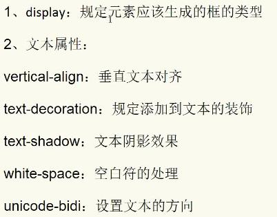  
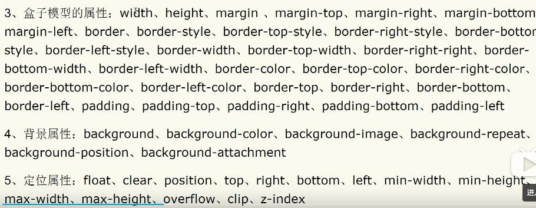  
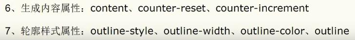  
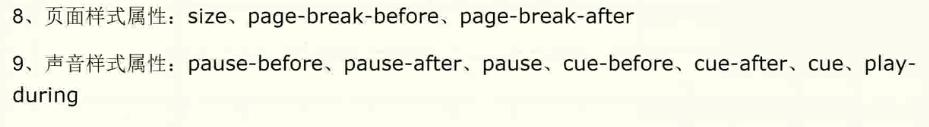
2. 有继承性的属性  
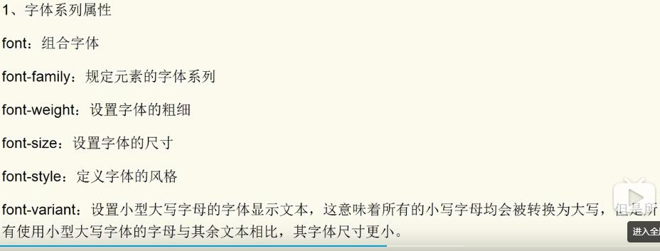  
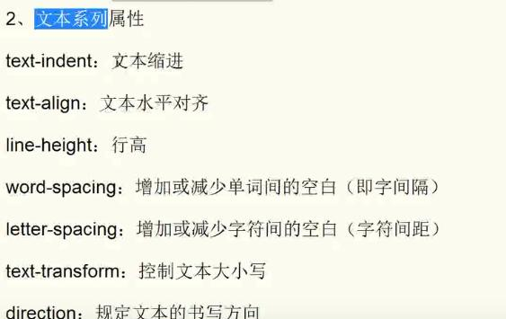  
  
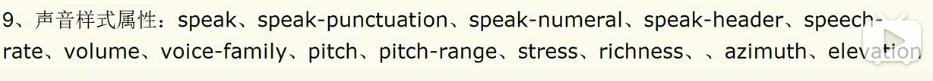 
 
## CSS层叠性

所谓层叠性是指多种CSS样式的叠加。

是浏览器处理冲突的一个能力,如果一个属性通过两个相同选择器设置到同一个元素上，那么这个时候一个属性就会将另一个属性层叠掉

比如先给某个标签指定了内部文字颜色为红色，接着又指定了颜色为蓝色，此时出现一个标签指定了相同样式不同值的情况，这就是样式冲突。

一般情况下，如果出现样式冲突，则会按照CSS书写的顺序，以最后的样式为准。

1. 样式冲突，遵循的原则是就近原则。 那个样式离着结构近，就执行那个样式。
2. 样式不冲突，不会层叠

## CSS继承性

所谓继承性是指书写CSS样式表时，子标签会继承父标签的某些样式，如文本颜色和字号。想要设置一个可继承的属性，只需将它应用于父元素即可。

简单的理解就是：  子承父业。

~~~
恰当地使用继承可以简化代码，降低CSS样式的复杂性。子元素可以继承父元素的样式（text-，font-，line-这些元素开头的都可以继承，以及color属性）
~~~

## CSS优先级

定义CSS样式时，经常出现两个或更多规则应用在同一元素上，这时就会出现优先级的问题。

~~~
继承样式的权重为0。即在嵌套结构中，不管父元素样式的权重多大，被子元素继承时，他的权重都为0，也就是说子元素定义的样式会覆盖继承来的样式。=
行内样式优先。应用style属性的元素，其行内样式的权重非常高，可以理解为远大于100。总之，他拥有比上面提高的选择器都大的优先级。
权重相同时，CSS遵循就近原则。也就是说靠近元素的样式具有最大的优先级，或者说排在最后的样式优先级最大。
CSS定义了一个!important命令，该命令被赋予最大的优先级。也就是说不管权重如何以及样式位置的远近，!important都具有最大优先级。
~~~

## CSS特殊性（Specificity）

关于CSS权重，我们需要一套计算公式来去计算，这个就是 CSS Specificity，我们称为CSS 特性或称非凡性，它是一个衡量CSS值优先级的一个标准 具体规范入如下：

specificity用一个四位的数 字串(CSS2是三位)来表示，更像四个级别，值从左到右，左面的最大，一级大于一级，数位之间没有进制，级别之间不可超越。 

| 继承或者* 的贡献值       | 0,0,0,0  |
| ------------------------ | -------- |
| 每个元素（标签）贡献值为 | 0,0,0,1  |
| 每个类，伪类贡献值为     | 0,0,1,0  |
| 每个ID贡献值为           | 0,1,0,0  |
| 每个行内样式贡献值       | 1,0,0,0  |
| 每个!important贡献值     | ∞ 无穷大 |

~~~
继承的权重为0
总结优先级：
1. 使用了 !important声明的规则。
2. 内嵌在 HTML 元素的 style属性里面的声明。
3. 使用了 ID 选择器的规则。
4. 使用了类选择器、属性选择器、伪元素和伪类选择器的规则。
5. 使用了元素选择器的规则。
6. 只包含一个通用选择器的规则。
7. 同一类选择器则遵循就近原则。
~~~
## CSS字体样式属性
**font-size字号**
font-size属性用于设置字号，该属性的值可以使用相对长度单位，也可以使用绝对长度单位。

**font-family字体**
font-family属性用于设置字体。网页中常用的字体有宋体、微软雅黑、黑体等。

**font-weight字体粗细**

字体加粗除了用 b  和 strong 标签之外，可以使用CSS 来实现，但是CSS 是没有语义的。

**font-style:字体风格**

字体倾斜除了用 i  和 em 标签之外，可以使用CSS 来实现，但是CSS 是没有语义的。

font-style属性用于定义字体风格，如设置斜体、倾斜或正常字体，其可用属性值如下：

normal：默认值，浏览器会显示标准的字体样式。

italic：浏览器会显示斜体的字体样式。

oblique：浏览器会显示倾斜的字体样式。

**font:综合设置字体样式**

>选择器{font: font-style  font-weight  font-size/line-height  font-family;}

>使用font属性时，必须按上面语法格式中的顺序书写，不能更换顺序，各个属性以空格隔开。

>注意：其中不需要设置的属性可以省略（取默认值），但必须保留font-size和font-family属性，否则font属性将不起作用。

## CSS外观属性
**color文本颜色**
color属性用于定义文本的颜色，其取值方式有如下3种：

1. 预定义的颜色值，如red，green，blue等。

2. 十六进制，如#FF0000，#FF6600，#29D794等。实际工作中，十六进制是最常用的定义颜色的方式。

3. RGB代码，如红色可以表示为rgb(255,0,0)或rgb(100%,0%,0%)。

>需要注意的是，如果使用RGB代码的百分比颜色值，取值为0时也不能省略百分号，必须写为0%。

**line-height:行间距**
ine-height属性用于设置行间距，就是行与行之间的距离，即字符的垂直间距，一般称为行高。line-height常用的属性值单位有三种，分别为像素px，相对值em和百分比%，实际工作中使用最多的是像素px

**text-align:水平对齐方式**
>text-align属性用于设置文本内容的水平对齐，相当于html中的align对齐属性。其可用属性值如下：

left：左对齐（默认值）

right：右对齐

center：居中对齐

**text-indent:首行缩进**

text-indent属性用于设置首行文本的缩进，其属性值可为不同单位的数值、em字符宽度的倍数、或相对于浏览器窗口宽度的百分比%，允许使用负值, 建议使用em作为设置单位。

**text-decoration 文本的装饰**

text-decoration   通常我们用于给链接修改装饰效果
| 值            | 描述                      |
| ------------ | ----------------------- |
| none         | 默认。定义标准的文本。             |
| underline    | 定义文本下的一条线。下划线 也是我们链接自带的 |
| overline     | 定义文本上的一条线。              |
| line-through | 定义穿过文本下的一条线。            |

------
## 盒子模型
从里到外:  
width height----padding----border-----margin  
### 盒子模型的宽和高
~~~
/**
 * 宽度和高度的单位
 1. px 像素 写死的单位
 2. % 百分比 动态计算的单位(自适应 响应式)
 */
~~~
### 盒子模型的内边距padding
~~~
/**
 * 上---右---下---左
 */
~~~
### 盒子模型的边框 border
~~~
边框线类型:
border-width
border-style
border-color
solid 实现
dashed 虚线
dotted 点状线

去掉边框线 border:0;
如果border属性只有边框宽度 没有边框类型和颜色 导致border属性失效

箭头制作:
/**
 * 三角箭头原理:正方形的任意相邻的两条边线
 * 然后旋转一定的角度 得到我们需要的任意方向的箭头
 * 三角形的大小由正方形的宽高去控制
 * 小三角的粗细由border边框线的宽度去控制
 */
.arrow{
	width:200px;
	height:200px;
	border-top:10px solid #000;
	border-left:10px solid #000;
	transform:retate(45deg);
}
	
小三角制作:
.box{
	width:0;
	height:0;
	border-width:100px;
	border-style:solid;
	border-color:red blue pink green;
	transparent 透明的颜色
}
~~~
### 盒子模型的外边距 margin
~~~
margin-top传递问题
大盒子里面嵌套小盒子 给小盒子加margin-top值 不但没有实现和大盒子自检的间距 反而传递到大盒子身上 导致整体下移
解决方法:
1. 给父元素添加overflow:hidden;
2. 给父元素添加padding-方位 这种方法会影响最后实际的宽高,需要在width/height基础上减掉 才不会影响最后实际的盒子大小
3. 给父元素添加border-方位 这种方法会影响......
4. 给子元素的margin-top 改为给父元素添加padding-top
~~~
## CSS 背景(background)

CSS 可以添加背景颜色和背景图片，以及来进行图片设置。

| background-color                                            | 背景颜色         |
| ----------------------------------------------------------- | ---------------- |
| background-image                                            | 背景图片地址     |
| background-repeat                                           | 是否平铺         |
| background-position                                         | 背景位置         |
| background-attachment                                       | 背景固定还是滚动 |
| 背景的合写（复合属性）                                      |                  |
| background:背景颜色 背景图片地址 背景平铺 背景滚动 背景位置 |                  |

## 背景图片(image)

~~~
background-image : none | url (url) 
~~~

background-image 属性允许指定一个图片展示在背景中（只有CSS3才可以多背景）可以和 background-color 连用。 如果图片不重复地话，图片覆盖不到地地方都会被背景色填充。 如果有背景图片平铺，则会覆盖背景颜色。

## 背景平铺（repeat）

~~~
background-repeat : repeat | no-repeat | repeat-x | repeat-y 
~~~

参数： 

repeat : 　背景图像在纵向和横向上平铺（默认的）

no-repeat : 　背景图像不平铺

repeat-x : 　背景图像在横向上平铺

repeat-y : 　背景图像在纵向平铺 

设置背景图片时，默认把图片在水平和垂直方向平铺以铺满整个元素。

repeat-x : 　背景图像在横向上平铺  

## 背景位置(position)

~~~css
background-position : length || length
background-position : position || position 
~~~

参数：

length : 　百分数 | 由浮点数字和单位标识符组成的长度值。请参阅长度单位 
position : 　top | center | bottom | left | center | right 

设置或检索对象的背景图像位置。必须先指定background-image属性。默认值为：(0% 0%)。
如果只指定了一个值，该值将用于横坐标。纵坐标将默认为50%。第二个值将用于纵坐标。

注意：

1. position 后面是x坐标和y坐标。 可以使用方位名词或者 精确单位。
2. 如果和精确单位和方位名字混合使用，则必须是x坐标在前，y坐标后面。比如 background-position: 15px top;   则 15px 一定是  x坐标   top是 y坐标。

## 背景附着

~~~css
background-attachment : scroll | fixed 
~~~

参数： 

scroll : 　背景图像是随对象内容滚动
fixed : 　背景图像固定 

说明： 

设置或检索背景图像是随对象内容滚动还是固定的。

## 背景简写

background属性的值的书写顺序官方并没有强制标准的。为了可读性，建议大家如下写：

background:背景颜色 背景图片地址 背景平铺 背景滚动 背景位置

~~~css
background: transparent url(image.jpg) repeat-y  scroll 50% 0 ;
~~~

## 背景透明

CSS3支持背景半透明的写法语法格式是:

~~~css
background: rgba(0,0,0,0.3);
~~~

## 盒子模型（Box Model）

所谓盒子模型就是把HTML页面中的元素看作是一个矩形的盒子，也就是一个盛装内容的容器。每个矩形都由元素的内容、内边距（padding）、边框（border）和外边距（margin）组成。

## 盒子边框（border）

~~~css
border : border-width || border-style || border-color 
~~~

边框属性—设置边框样式（border-style）

边框样式用于定义页面中边框的风格，常用属性值如下：

~~~
none：没有边框即忽略所有边框的宽度（默认值）

solid：边框为单实线(最为常用的)

dashed：边框为虚线  

dotted：边框为点线

double：边框为双实线
~~~

**表格的细线边框**

以前学过的html表格边框很粗，这里只需要CSS一句话就可以美观起来。 让我们真的相信，CSS就是我们的白马王子（白雪公主）。

table{ border-collapse:collapse; }  collapse 单词是合并的意思

border-collapse:collapse; 表示边框合并在一起。

**圆角边框**

~~~css
border-radius: 左上角  右上角  右下角  左下角;
~~~

## 内边距（padding）

padding属性用于设置内边距。  是指边框与内容之间的距离。

padding-top:上内边距

padding-right:右内边距

padding-bottom:下内边距

padding-left:左内边距

## 外边距（margin）

margin属性用于设置外边距。  设置外边距会在元素之间创建“空白”， 这段空白通常不能放置其他内容。

margin-top:上外边距

margin-right:右外边距

margin-bottom:下外边距

margin-left:上外边距

margin:上外边距 右外边距  下外边距  左外边

## 外边距合并

使用margin定义块元素的垂直外边距时，可能会出现外边距的合并。

**相邻块元素垂直外边距的合并**

当上下相邻的两个块元素相遇时，如果上面的元素有下外边距margin-bottom，下面的元素有上外边距margin-top，则他们之间的垂直间距不是margin-bottom与margin-top之和，而是两者中的较大者。这种现象被称为相邻块元素垂直外边距的合并（也称外边距塌陷）。

**嵌套块元素垂直外边距的合并**

对于两个嵌套关系的块元素，如果父元素没有上内边距及边框，则父元素的上外边距会与子元素的上外边距发生合并，合并后的外边距为两者中的较大者，即使父元素的上外边距为0，也会发生合并。

~~~
解决方案：
1. 可以为父元素定义1像素的上边框或上内边距。
2. 可以为父元素添加overflow:hidden。
~~~

## 宽度和高度

使用宽度属性width和高度属性height可以对盒子的大小进行控制。

width和height的属性值可以为不同单位的数值或相对于父元素的百分比%，实际工作中最常用的是像素值。

## 盒子阴影

~~~css
box-shadow:水平阴影 垂直阴影 模糊距离 阴影尺寸 阴影颜色  内/外阴影；
~~~

## 浮动(float)

**什么是浮动？**

元素的浮动是指设置了浮动属性的元素会脱离标准普通流的控制，移动到其父元素中指定位置的过程。

| 属性值 | 描述                 |
| ------ | -------------------- |
| left   | 元素向左浮动         |
| right  | 元素向右浮动         |
| none   | 元素不浮动（默认值） |

浮动首先创建包含块的概念（包裹）。就是说， 浮动的元素总是找理它最近的父级元素对齐。但是不会超出内边距的范围。 

~~~
浮动的元素排列位置，跟上一个元素（块级）有关系。如果上一个元素有浮动，则A元素顶部会和上一个元素的顶部对齐；如果上一个元素是标准流，则A元素的顶部会和上一个元素的底部对齐。
元素添加浮动后，元素会具有行内块元素的特性。元素的大小完全取决于定义的大小或者默认的内容多少浮动根据元素书写的位置来显示相应的浮动。
~~~

float      浮 漏 特   

浮：    加了浮动的元素盒子是浮起来的，漂浮在其他的标准流盒子上面。
漏：    加了浮动的盒子，不占位置的，它浮起来了，它原来的位置漏 给了标准流的盒子。
特：    特别注意，首先浮动的盒子需要和标准流的父级搭配使用， 其次 特别的注意浮动可以使元素显示模式体现为行内块特性。

 ## 清除浮动的本质

清除浮动主要为了解决父级元素因为子级浮动引起内部高度为0 的问题。

**清除浮动的方法**

其实本质叫做闭合浮动更好一些, 记住，清除浮动就是把浮动的盒子圈到里面，让父盒子闭合出口和入口不让他们出来影响其他元素。

在CSS中，clear属性用于清除浮动，其基本语法格式如下：

~~~
选择器{clear:属性值;}
~~~

| 属性值 | 描述                                       |
| ------ | ------------------------------------------ |
| left   | 不允许左侧有浮动元素（清除左侧浮动的影响） |
| right  | 不允许右侧有浮动元素（清除右侧浮动的影响） |
| both   | 同时清除左右两侧浮动的影响                 |

## 额外标签法


~~~
是W3C推荐的做法是通过在浮动元素末尾添加一个空的标签例如 <div style=”clear:both”></div>，或则其他标签br等亦可。
~~~

优点： 通俗易懂，书写方便

缺点： 添加许多无意义的标签，结构化较差。  我只能说，w3c你推荐的方法我不接受，你不值得拥有。。。

## 父级添加overflow属性方法

可以通过触发BFC的方式，可以实现清除浮动效果。

~~~
可以给父级添加： overflow为 hidden|auto|scroll  都可以实现。
~~~

优点：  代码简洁

缺点：  内容增多时候容易造成不会自动换行导致内容被隐藏掉，无法显示需要溢出的元素。

## 使用after伪元素清除浮动

~~~css
 .clearfix:after {  content: "."; display: block; height: 0; clear: both; visibility: hidden;  }   

 .clearfix {*zoom: 1;}   /* IE6、7 专有 */
~~~

优点： 符合闭合浮动思想  结构语义化正确

缺点： 由于IE6-7不支持:after，使用 zoom:1触发 hasLayout。

## 使用before和after双伪元素清除浮动

~~~css
.clearfix:before,.clearfix:after { 
  content:"";
  display:table;  /* 这句话可以出发BFC BFC可以清除浮动,BFC我们后面讲 */
}
.clearfix:after {
 clear:both;
}
.clearfix {
  *zoom:1;
}
~~~

优点：  代码更简洁

缺点：  由于IE6-7不支持:after，使用 zoom:1触发 hasLayout。

## 定位(position)

## 元素的定位属性

元素的定位属性主要包括定位模式和边偏移两部分。

| 边偏移属性 | 描述                                           |
| ---------- | ---------------------------------------------- |
| top        | 顶端偏移量，定义元素相对于其父元素上边线的距离 |
| bottom     | 底部偏移量，定义元素相对于其父元素下边线的距离 |
| left       | 左侧偏移量，定义元素相对于其父元素左边线的距离 |
| right      | 右侧偏移量，定义元素相对于其父元素右边线的距离 |

在CSS中，position属性用于定义元素的定位模式，其基本语法格式如下：

| 值       | 描述                                             |
| -------- | ------------------------------------------------ |
| static   | 自动定位（默认定位方式）                         |
| relative | 相对定位，相对于其原文档流的位置进行定位         |
| absolute | 绝对定位，相对于其上一个已经定位的父元素进行定位 |
| fixed    | 固定定位，相对于浏览器窗口进行定位               |
## 静态定位(static)

静态定位是所有元素的默认定位方式，当position属性的取值为static时，可以将元素定位于静态位置。 所谓静态位置就是各个元素在HTML文档流中默认的位置。

## 相对定位（relative）

相对定位是将元素相对于它在标准流中的位置进行定位，当position属性的取值为relative时，可以将元素定位于相对位置。

~~~
1. 相对定位最重要的一点是，它可以通过边偏移移动位置，但是原来的所占的位置，继续占有。
2. 其次，每次移动的位置，是以自己的左上角为基点移动（相对于自己来移动位置）
就是说，相对定位的盒子仍在标准流中，它后面的盒子仍以标准流方式对待它。（相对定位不脱标）
~~~
## 绝对定位absolute

绝对定位最重要的一点是，它可以通过边偏移移动位置，但是它完全脱标，完全不占位置。

父级没有定位以浏览器为准对齐(document文档)

绝对定位是将元素依据最近的已经定位（绝对、固定或相对定位）的父元素（祖先）进行定位。

## 子绝父相

子级是绝对定位的话，父级要用相对定位。

因为子级是绝对定位，不会占有位置， 可以放到父盒子里面的任何一个地方。父盒子布局时，需要占有位置，因此父亲只能是 相对定位。这就是子绝父相的由来。
## 绝对定位的盒子居中

1. 首先left 50%
2. 然后走自己的外边距负自己的宽度的一半即可。

## 固定定位fixed

当对元素设置固定定位后，它将脱离标准文档流的控制，始终依据浏览器窗口来定义自己的显示位置。不管浏览器滚动条如何滚动也不管浏览器窗口的大小如何变化，该元素都会始终显示在浏览器窗口的固定位置。

1. 固定定位的元素跟父亲没有任何关系，只认浏览器。
2. 固定定位完全脱标，不占有位置，不随着滚动条滚动。

| 定位模式         | 是否脱标占有位置   | 是否可以使用边偏移 | 移动位置基准           |
| ------------ | ---------- | --------- | ---------------- |
| 静态static     | 不脱标，正常模式   | 不可以       | 正常模式             |
| 相对定位relative | 不脱标，占有位置   | 可以        | 相对自身位置移动（自恋型）    |
| 绝对定位absolute | 完全脱标，不占有位置 | 可以        | 相对于定位父级移动位置（拼爹型） |
| 固定定位fixed    | 完全脱标，不占有位置 | 可以        | 相对于浏览器移动位置（认死理型） |

## 元素的显示与隐藏
在CSS中有三个显示和隐藏的单词比较常见，我们要区分开，他们分别是 display visibility overflow。

## display 显示
display 设置或检索对象是否及如何显示。

display : none 隐藏对象 与它相反的是 display:block 除了转换为块级元素之外，同时还有显示元素的意思。

特点： 隐藏之后，不再保留位置。

## visibility 可见性

设置或检索是否显示对象。

visible : 　对象可视

hidden : 　对象隐藏

特点： 隐藏之后，继续保留原有位置。

## overflow 溢出

检索或设置当对象的内容超过其指定高度及宽度时如何管理内容。

visible : 　不剪切内容也不添加滚动条。

auto : 　 超出自动显示滚动条，不超出不显示滚动条

hidden : 　不显示超过对象尺寸的内容，超出的部分隐藏掉

scroll : 　不管超出内容否，总是显示滚动条

## 背景
### background-color
指定要使用的背景颜色  
background-color 不能继承默认值是transparent 透明 即一个元素没有指定背景色, 那么北京就是透明的
transparent 透明色 默认值
inherit 指定背景颜色 从父元素继承
### background-image
属性不能继承 一个元素可以引入多张背景图片 
### background-repeat
指定如何重复背景图片 默认情况下 水平垂直重复  
- repeat 背景图像向水平和垂直方向重复
- repeat-x 只有水平位置会重复背景图像
- repeat-y 只有垂直位置会重复图像
- no-repeat background-image不会重复
- inherit 指定background-repeat属性设置应该从父元素继承
### background-position
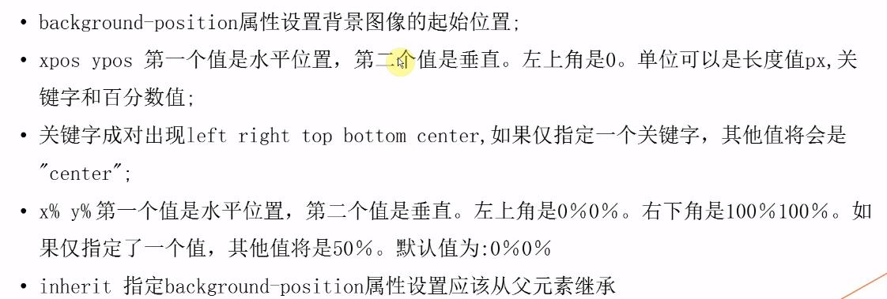
### background-attachment
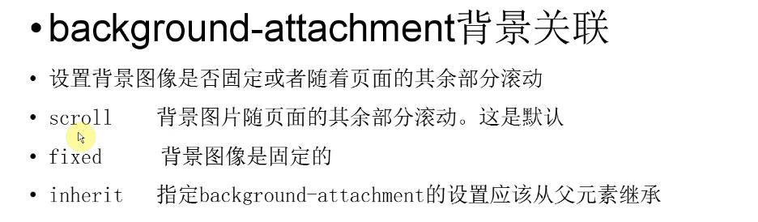
### background-size 
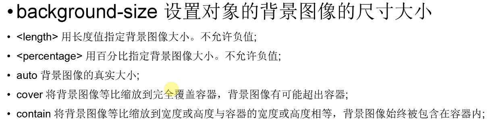
### background-origin
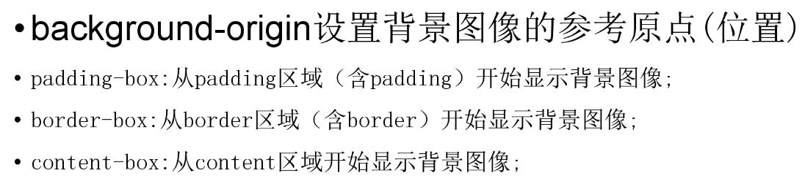
### background-clip
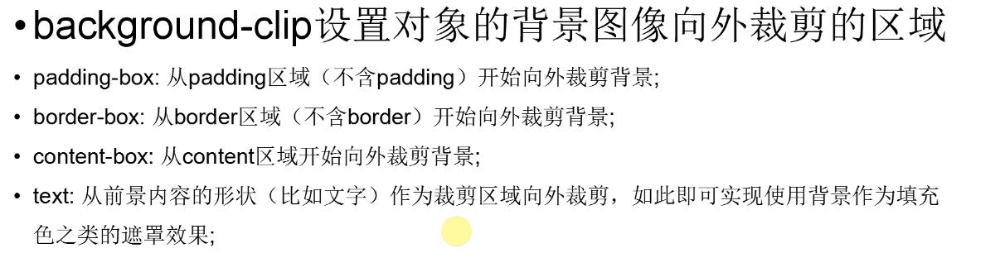  
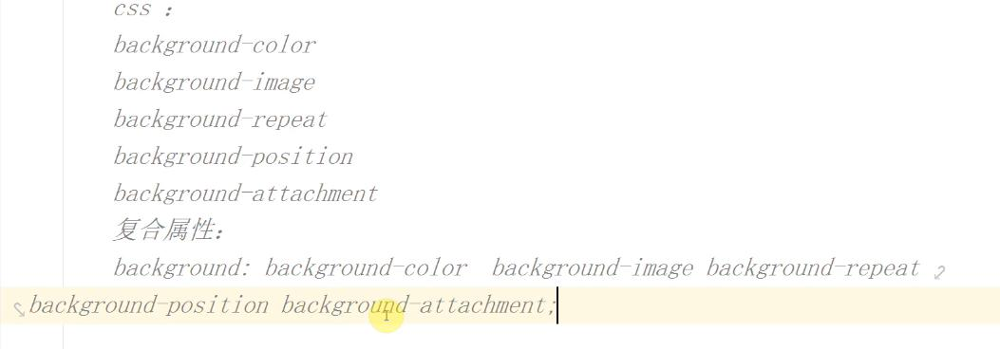

## overflow多个作用
1. 溢出隐藏:
超出内容之外的的部分给隐藏起来
2. 清理浮动
清除浮动产生的影响
3. 解决margin-top的传递问题
margin-top传递给父元素的问题

## 多个元素在一行显示
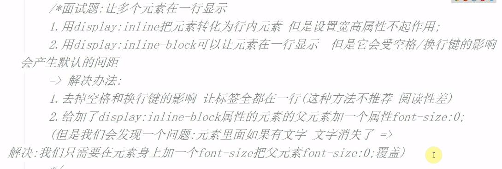  
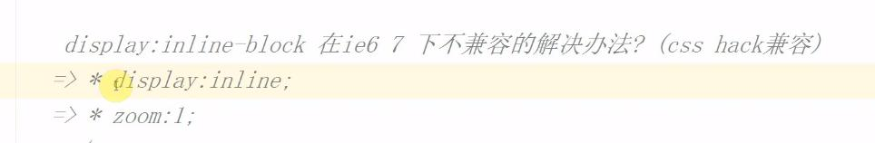
## 单行文本出现省略号
~~~
一共需要四个条件:
width:200px;宽度
overflow:hidden;溢出隐藏
white-space:nowrap;强制文字不折行
text-overflow:ellipsis;文字隐藏的方式 以省略号的方式隐藏
~~~
## 多行文本出现省略号
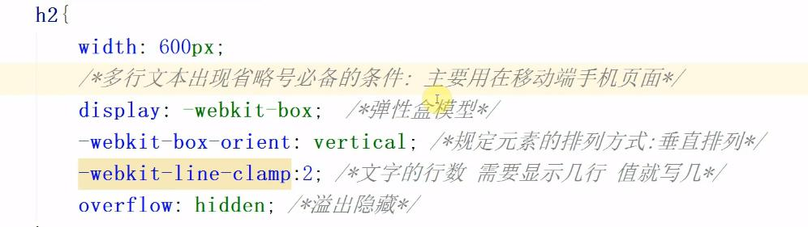

## float元素的特点
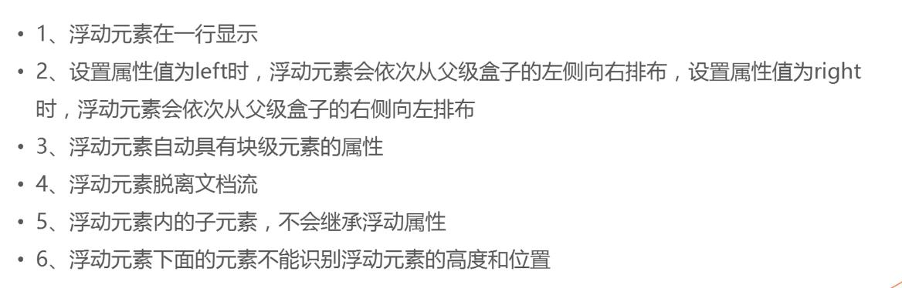

## 清理浮动
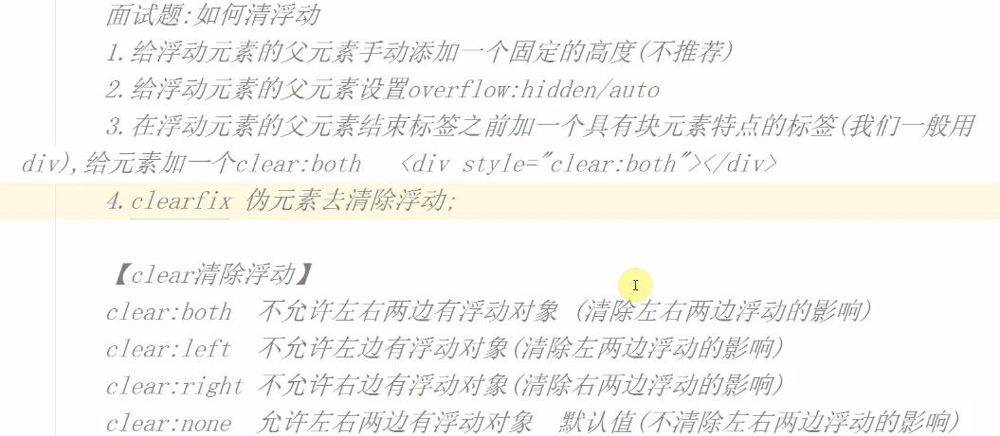  
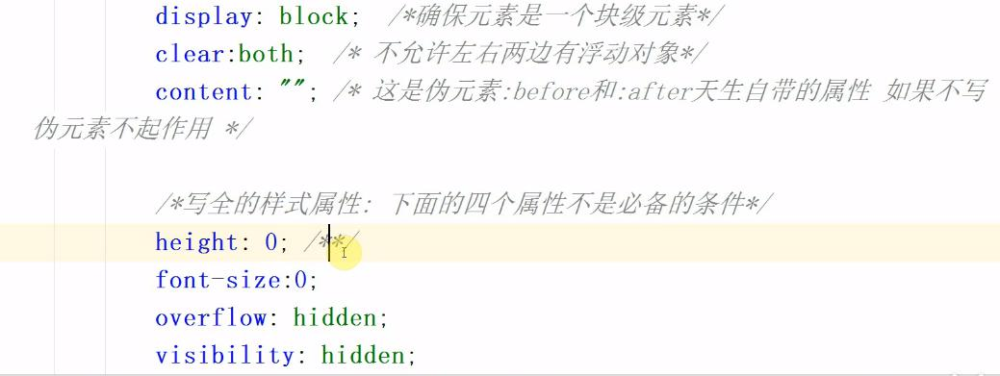

## 让元素消失在视野里
1. 透明度opacity：0
2. display：none；
3. width:0;/height:0；和overflow:hidded;
4. line-height：0；和overflow：hidden；(没有设置高度的情况下)
5. visibility：hidden；让所有可见性的元素隐藏
6. margin、padding设置的足够大 
7. 利用transform属性 让translate坐标设置的足够大

## 定位
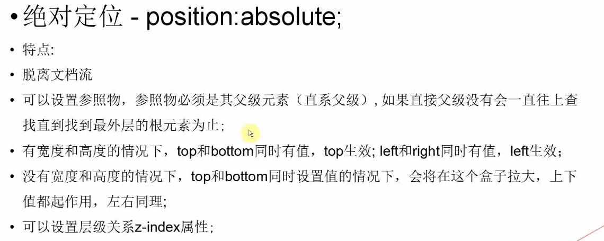  
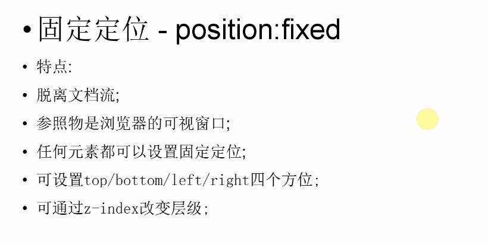  
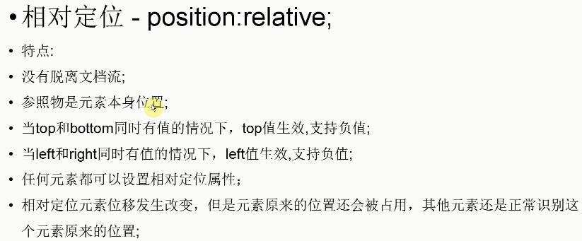  
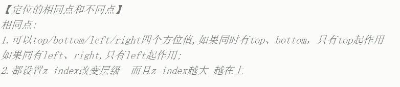  
  
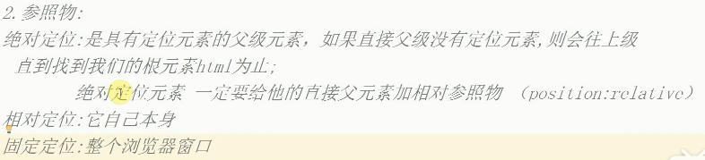
## z-index的特点
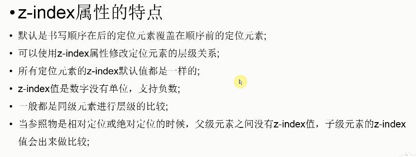

## CSS用户界面样式
所谓的界面样式，就是更改一些用户操作样式， 比如更改用户的鼠标样式，表单轮廓等。

## 鼠标样式cursor
设置或检索在对象上移动的鼠标指针采用何种系统预定义的光标形状。

`cursor :  default  小白 | pointer  小手  | move  移动  |  text  文本`
## 轮廓outline
是绘制于元素周围的一条线，位于边框边缘的外围，可起到突出元素的作用。

~~~
outline : outline-color ||outline-style || outline-width
~~~
### 防止拖拽文本域resize
resize：none    这个单词可以防止火狐谷歌等浏览器随意的拖动文本域。
## vertical-align 垂直对齐
`vertical-align : baseline |top |middle |bottom`

设置或检索对象内容的垂直对其方式。

vertical-align 不影响块级元素中的内容对齐，它只针对于 行内元素或者行内块元素，特别是行内块元素

### 去除图片底侧空白缝隙
图片或者表单等行内块元素，他的底线会和父级盒子的基线对齐。这样会造成一个问题，就是图片底侧会有一个空白缝隙。3px
~~~
解决办法：
1. 给img vertical-align:middle | top等等。让图片不要和基线对齐。
2. 给img 添加 display：block; 转换为块级元素就不会存在问题了。
~~~

## 溢出的文字隐藏                 
## word-break:自动换行
normal   使用浏览器默认的换行规则。

break-all   允许在单词内换行。

keep-all    只能在半角空格或连字符处换行。

主要处理英文单词

## white-space

white-space设置或检索对象内文本显示方式。通常我们使用于强制一行显示内容 

normal : 　默认处理方式
nowrap : 　强制在同一行内显示所有文本，直到文本结束或者遭遇br标签对象才换行。

可以处理中文

## text-overflow 文字溢出
`text-overflow : clip | ellipsis`

设置或检索是否使用一个省略标记（...）标示对象内文本的溢出

clip : 　不显示省略标记（...），而是简单的裁切 

ellipsis : 　当对象内文本溢出时显示省略标记（...）
~~~
注意一定要首先强制一行内显示，再次和overflow属性  搭配使用
~~~
## BFC
BFC(Block formatting context)

直译为"块级格式化上下文"。

## 那些元素会具有BFC的条件

不是所有的元素模式都能产生BFC，w3c 规范： 

display 属性为 block, list-item, table 的元素，会产生BFC。

## 什么情况下可以让元素产生BFC
-float属性不为none

-position为absolute或fixed

-display为inline-block, table-cell, table-caption, flex, inline-flex

-overflow不为visible。

## BFC元素所具有的特性
1. 在BFC中，盒子从顶端开始垂直地一个接一个地排列.

2. 盒子垂直方向的距离由margin决定。属于同一个BFC的两个相邻盒子的margin会发生重叠

3. 在BFC中，每一个盒子的左外边缘（margin-left）会触碰到容器的左边缘(border-left)（对于从右到左的格式来说，则触碰到右边缘）。

~~~
1. BFC的区域不会与浮动盒子产生交集，而是紧贴浮动边缘。
2. 计算BFC的高度时，自然也会检测浮动或者定位的盒子高度。
~~~

它是一个独立的渲染区域，只有Block-level box参与， 它规定了内部的Block-level Box如何布局，并且与这个区域外部毫不相干。

## BFC的主要用途
(1) 清除元素内部浮动

只要把父元素设为BFC就可以清理子元素的浮动了，最常见的用法就是在父元素上设置overflow: hidden样式，对于IE6加上zoom:1就可以了。

主要用到 

```
计算BFC的高度时，自然也会检测浮动或者定位的盒子高度。
```

(2) 解决外边距合并问题

主要用到：

```
盒子垂直方向的距离由margin决定。属于同一个BFC的两个相邻盒子的margin会发生重叠
```

属于同一个BFC的两个相邻盒子的margin会发生重叠，那么我们创建不属于同一个BFC，就不会发生margin重叠了。

(3) 制作右侧自适应的盒子问题

主要用到:

```
普通流体元素BFC后，为了和浮动元素不产生任何交集，顺着浮动边缘形成自己的封闭上下文
```
## BFC 总结

BFC就是页面上的一个隔离的独立容器，容器里面的子元素不会影响到外面的元素。反之也如此。包括浮动，和外边距合并等等，因此，有了这个特性，我们布局的时候就不会出现意外情况了。
## 选择器
## 目标伪类选择器
:target目标伪类选择器 :选择器可用于选取当前活动的目标元素

```css
:target {
		color: red;
		font-size: 30px;
}
```
## 属性选择器

选取标签带有某些特殊属性的选择器 我们成为属性选择器

```css
/* 获取到 拥有 该属性的元素 */
div[class^=font] { /*  class^=font 表示 font 开始位置就行了 */
			color: pink;
		}
div[class$=footer] { /*  class$=footer 表示 footer 结束位置就行了 */
			color: skyblue;
		}
div[class*=tao] { /* class*=tao  *=  表示tao 在任意位置都可以 */
			color: green;
		}
```

```html
<div class="font12">属性选择器</div>
    <div class="font12">属性选择器</div>
    <div class="font24">属性选择器</div>
    <div class="font24">属性选择器</div>
    <div class="font24">属性选择器</div>
    <div class="24font">属性选择器123</div>
    <div class="sub-footer">属性选择器footer</div>
    <div class="jd-footer">属性选择器footer</div>
    <div class="news-tao-nav">属性选择器</div>
    <div class="news-tao-header">属性选择器</div>
    <div class="tao-header">属性选择器</div>
```

## 伪元素选择器（CSS3)

1. E::first-letter文本的第一个单词或字（如中文、日文、韩文等）
2. E::first-line 文本第一行；
3. E::selection 可改变选中文本的样式；

```css
p::first-letter {
  font-size: 20px;
  color: hotpink;
}

/* 首行特殊样式 */
p::first-line {
  color: skyblue;
}

p::selection {
  /* font-size: 50px; */
  color: orange;
}
```


E::before和E::after

在E元素内部的开始位置和结束位创建一个元素，该元素为行内元素，且必须要结合content属性使用。

```css
div::befor {
  content:"开始";
}
div::after {
  content:"结束";
}
```

E:after、E:before 在旧版本里是伪元素，CSS3的规范里“:”用来表示伪类，“::”用来表示伪元素，但是在高版本浏览器下E:after、E:before会被自动识别为E::after、E::before，这样做的目的是用来做兼容处理。

":" 与 "::" 区别在于区分伪类和伪元素

之所以被称为伪元素，是因为他们不是真正的页面元素，html没有对应的元素，但是其所有用法和表现行为与真正的页面元素一样，可以对其使用诸如页面元素一样的css样式，表面上看上去貌似是页面的某些元素来展现，实际上是css样式展现的行为，因此被称为伪元素。是伪元素在html代码机构中的展现，可以看出无法伪元素的结构无法审查

**注意**

伪元素:before和:after添加的内容默认是inline元素**；这个两个伪元素的`content`属性，表示伪元素的内容,设置:before和:after时必须设置其`content`属性，否则伪元素就不起作用。

## 背景缩放

通过background-size设置背景图片的尺寸，就像我们设置img的尺寸一样，在移动Web开发中做屏幕适配应用非常广泛。

其参数设置如下：

a) 可以设置长度单位(px)或百分比（设置百分比时，参照盒子的宽高）

b) 设置为cover时，会自动调整缩放比例，保证图片始终填充满背景区域，如有溢出部分则会被隐藏。我们平时用的cover 最多

c) 设置为contain会自动调整缩放比例，保证图片始终完整显示在背景区域。

```css
background-image: url('images/gyt.jpg');
			background-size: 300px 100px;
			/* background-size: contain; */
			/* background-size: cover; */
```

## 多背景(CSS3)

以逗号分隔可以设置多背景，可用于自适应布局  做法就是 用逗号隔开就好了。

- 一个元素可以设置多重背景图像。 
- 每组属性间使用逗号分隔。 
- 如果设置的多重背景图之间存在着交集（即存在着重叠关系），前面的背景图会覆盖在后面的背景图之上。
- 为了避免背景色将图像盖住，背景色通常都定义在最后一组上，

```css
background:url(test1.jpg) no-repeat scroll 10px 20px/50px 60px  ,
	   url(test1.jpg) no-repeat scroll 10px 20px/70px 90px ,
	   url(test1.jpg) no-repeat scroll 10px 20px/110px 130px c #aaa;
```

- ​

## 凹凸文字

```css
<head>
        <meta charset="utf-8">
        <style>
        body {
        	background-color: #ccc;
        }
		div {
			color: #ccc;
			font: 700 80px "微软雅黑";
		}
		div:first-child {
			/* text-shadow: 水平位置  垂直位置  模糊距离 阴影颜色; */
			text-shadow: 1px 1px 1px #000, -1px -1px 1px #fff;
		}
		div:last-child {
			/* text-shadow: 水平位置  垂直位置  模糊距离 阴影颜色; */
			text-shadow: -1px -1px 1px #000, 1px 1px 1px #fff;
		}

        </style>
    </head>
    <body>
    <div>我是凸起的文字</div>
    <div>我是凹下的文字</div>
    </body>
```


## CSS3盒模型

CSS3中可以通过box-sizing 来指定盒模型，即可指定为content-box、border-box，这样我们计算盒子大小的方式就发生了改变。

可以分成两种情况：

1、box-sizing: content-box  盒子大小为 width + padding + border   content-box:此值为其默认值，其让元素维持W3C的标准Box Mode

2、box-sizing: border-box  盒子大小为 width    就是说  padding 和 border 是包含到width里面的

注：上面的标注的width指的是CSS属性里设置的width: length，content的值是会自动调整的。

```css
div:first-child {
			width: 200px;
			height: 200px;
			background-color: pink; 
			box-sizing: content-box;  /*  就是以前的标准盒模型  w3c */
			padding: 10px;
			border: 15px solid red;
			/* 盒子大小为 width + padding + border   content-box:此值为其默认值，其让元素维持W3C的标准Box Mode */
		}
		div:last-child {
			width: 200px;
			height: 200px;
			background-color: purple;
			padding: 10px;
			box-sizing: border-box;   /* padding border  不撑开盒子 */
			border: 15px solid red;
			/* margin: 10px; */
			/* 盒子大小为 width    就是说  padding 和 border 是包含到width里面的 */
}
```

## 过渡(CSS3)

过渡（transition)是CSS3中具有颠覆性的特征之一，我们可以在不使用 Flash 动画或 JavaScript 的情况下，当元素从一种样式变换为另一种样式时为元素添加效果。

在CSS3里使用transition可以实现补间动画（过渡效果），并且当前元素只要有“属性”发生变化时即存在两种状态(我们用A和B代指），就可以实现平滑的过渡，为了方便演示采用hover切换两种状态，但是并不仅仅局限于hover状态来实现过渡。

语法格式:

~~~
transition: 要过渡的属性  花费时间  运动曲线  何时开始;
如果有多组属性变化，还是用逗号隔开。
~~~

| 属性                         | 描述                      | CSS  |
| -------------------------- | ----------------------- | ---- |
| transition                 | 简写属性，用于在一个属性中设置四个过渡属性。  | 3    |
| transition-property        | 规定应用过渡的 CSS 属性的名称。      | 3    |
| transition-duration        | 定义过渡效果花费的时间。默认是 0。      | 3    |
| transition-timing-function | 规定过渡效果的时间曲线。默认是 "ease"。 | 3    |
| transition-delay           | 规定过渡效果何时开始。默认是 0。       | 3    |

如果想要所有的属性都变化过渡， 写一个all 就可以

transition-duration  花费时间  单位是  秒     s    比如 0.5s    这个s单位必须写      ms 毫秒

运动曲线   默认是 ease

 何时开始  默认是 0s  立马开始

 ~~~css
div {
			width: 200px;
			height: 100px;
			background-color: pink;
			/* transition: 要过渡的属性  花费时间  运动曲线  何时开始; */
			transition: width 0.6s ease 0s, height 0.3s ease-in 1s;
			/* transtion 过渡的意思  这句话写到div里面而不是 hover里面 */
  
			
}
div:hover {  /* 鼠标经过盒子，我们的宽度变为400 */

			width: 600px;
			height: 300px
}

transition: all 0.6s;  /* 所有属性都变化用all 就可以了  后面俩个属性可以省略 */
~~~

## 2D变形(CSS3) transform

transform是CSS3中具有颠覆性的特征之一，可以实现元素的位移、旋转、倾斜、缩放，甚至支持矩阵方式，配合过渡和即将学习的动画知识，可以取代大量之前只能靠Flash才可以实现的效果。

变形转换 transform    transform  变换 变形的意思   《 transformers 变形金刚》

###  移动 translate(x, y)    

translate 移动平移的意思

```css
translate(50px,50px);
```

使用translate方法来将文字或图像在水平方向和垂直方向上分别垂直移动50像素。

可以改变元素的位置，x、y可为负值；

~~~
 translate(x,y)水平方向和垂直方向同时移动（也就是X轴和Y轴同时移动）
 translateX(x)仅水平方向移动（X轴移动）
 translateY(Y)仅垂直方向移动（Y轴移动）
~~~

~~~css
.box {
  width: 499.9999px;
  height: 400px;
  background: pink;
  position: absolute;
  left:50%;
  top:50%;
  transform:translate(-50%,-50%);  /* 走的自己的一半 */
}
~~~

## 缩放 scale(x, y) 

```css
transform:scale(0.8,1);
```

可以对元素进行水平和垂直方向的缩放。该语句使用scale方法使该元素在水平方向上缩小了20%，垂直方向上不缩放。

~~~
scale(X,Y)使元素水平方向和垂直方向同时缩放（也就是X轴和Y轴同时缩放）
scaleX(x)元素仅水平方向缩放（X轴缩放）
scaleY(y)元素仅垂直方向缩放（Y轴缩放）
~~~

scale()的取值默认的值为1，当值设置为0.01到0.99之间的任何值，作用使一个元素缩小；而任何大于或等于1.01的值，作用是让元素放大

 ### 旋转 rotate(deg) 

可以对元素进行旋转，正值为顺时针，负值为逆时针；

~~~css
transform:rotate(45deg);
~~~

注意单位是 deg 度数  	

```css
 div{transform-origin: left top;transform: rotate(45deg); }  /* 改变元素原点到左上角，然后进行顺时旋转45度 */    
```

 如果是4个角，可以用 left top这些，如果想要精确的位置， 可以用  px 像素。

~~~css
 div{transform-origin: 10px 10px;transform: rotate(45deg); }  /* 改变元素原点到x 为10  y 为10，然后进行顺时旋转45度 */ 
~~~

### 倾斜 skew(deg, deg) 

```css
transform:skew(30deg,0deg);
```

该实例通过skew方法把元素水平方向上倾斜30度，处置方向保持不变。

可以使元素按一定的角度进行倾斜，可为负值，第二个参数不写默认为0。

## 3D变形(CSS3) transform

2d    x  y  

3d  x  y  z

 左手坐标系

伸出左手，让拇指和食指成“L”形，大拇指向右，食指向上，中指指向前方。这样我们就建立了一个左手坐标系，拇指、食指和中指分别代表X、Y、Z轴的正方向。

x左边是负的，右边是正的

y 上面是负的， 下面是正的

z 里面是负的， 外面是正的

###  rotateX() 

就是沿着 x 立体旋转.
 ~~~css
img {
  transition:all 0.5s ease 0s;
}
img:hove {

  transform:rotateX(180deg);
}
~~~

### rotateY()
沿着y轴进行旋转
~~~css
img {
  transition:all 0.5s ease 0s;
}
img:hove {

  transform:rotateX(180deg);
}
~~~

### rotateZ()

沿着z轴进行旋转

~~~css
img {
  transition:all .25s ease-in 0s;
}
img:hover {
  /* transform:rotateX(180deg); */
  /* transform:rotateY(180deg); */
  /* transform:rotateZ(180deg); */
  /* transform:rotateX(45deg) rotateY(180deg) rotateZ(90deg) skew(0,10deg); */
}
~~~

### 透视(perspective)

电脑显示屏是一个2D平面，图像之所以具有立体感（3D效果），其实只是一种视觉呈现，通过透视可以实现此目的。

透视可以将一个2D平面，在转换的过程当中，呈现3D效果。

- 透视原理： 近大远小 。
- 浏览器透视：把近大远小的所有图像，透视在屏幕上。
- perspective：视距，表示视点距离屏幕的长短。视点，用于模拟透视效果时人眼的位置

注：并非任何情况下需要透视效果，根据开发需要进行设置。

perspective 一般作为一个属性，设置给父元素，作用于所有3D转换的子元素

### translateX(x)

仅水平方向移动**（X轴移动）

主要目的实现移动效果

### translateY(y)

仅垂直方向移动（Y轴移动）

### translateZ(z)

transformZ的直观表现形式就是大小变化，实质是XY平面相对于视点的远近变化（说远近就一定会说到离什么参照物远或近，在这里参照物就是perspective属性）。比如设置了perspective为200px;那么transformZ的值越接近200，就是离的越近，看上去也就越大，超过200就看不到了，因为相当于跑到后脑勺去了，我相信你正常情况下，是看不到自己的后脑勺的。

### translate3d(x,y,z)

其中，x和y可以是长度值，也可以是百分比，百分比是相对于其本身元素水平方向的宽度和垂直方向的高度和；z只能设置长度值

###  backface-visibility 

backface-visibility 属性定义当元素不面向屏幕时是否可见。

## 动画(CSS3) animation

动画是CSS3中具有颠覆性的特征之一，可通过设置多个节点来精确控制一个或一组动画，常用来实现复杂的动画效果。

语法格式：

~~~css 
animation:动画名称 动画时间 运动曲线  何时开始  播放次数  是否反方向;
~~~

~~~css
@keyframes 动画名称 {
  from{ 开始位置 }  0%
  to{  结束  }  100%
}
~~~

~~~
animation-iteration-count:infinite;  无限循环播放
animation-play-state:paused;   暂停动画"
~~~

## 伸缩布局(CSS3)

CSS3在布局方面做了非常大的改进，使得我们对块级元素的布局排列变得十分灵活，适应性非常强，其强大的伸缩性，在响应式开中可以发挥极大的作用。

主轴：Flex容器的主轴主要用来配置Flex项目，默认是水平方向

侧轴：与主轴垂直的轴称作侧轴，默认是垂直方向的

方向：默认主轴从左向右，侧轴默认从上到下

主轴和侧轴并不是固定不变的，通过flex-direction可以互换。

Flex布局的语法规范经过几年发生了很大的变化，也给Flexbox的使用带来一定的局限性，因为语法规范版本众多，浏览器支持不一致，致使Flexbox布局使用不多

**2、各属性详解******

1.flex子项目在主轴的缩放比例，不指定flex属性，则不参与伸缩分配

min-width  最小值      min-width: 280px  最小宽度  不能小于 280

max-width: 1280px  最大宽度  不能大于 1280

2.flex-direction调整主轴方向（默认为水平方向）

flex-direction: column 垂直排列

flex-direction: row  水平排列

http://m.ctrip.com/html5/   携程网手机端地址

3、justify-content调整主轴对齐（水平对齐）

子盒子如何在父盒子里面水平对齐

| 值             | 描述                       | 白话文                     |
| ------------- | ------------------------ | ----------------------- |
| flex-start    | 默认值。项目位于容器的开头。           | 让子元素从父容器的开头开始排序但是盒子顺序不变 |
| flex-end      | 项目位于容器的结尾。               | 让子元素从父容器的后面开始排序但是盒子顺序不变 |
| center        | 项目位于容器的中心。               | 让子元素在父容器中间显示            |
| space-between | 项目位于各行之间留有空白的容器内。        | 左右的盒子贴近父盒子，中间的平均分布空白间距  |
| space-around  | 项目位于各行之前、之间、之后都留有空白的容器内。 | 相当于给每个盒子添加了左右margin外边距  |

4、align-items调整侧轴对齐（垂直对齐）

子盒子如何在父盒子里面垂直对齐（单行）

| 值          | 描述              | 白话文                         |
| ---------- | --------------- | --------------------------- |
| stretch    | 默认值。项目被拉伸以适应容器。 | 让子元素的高度拉伸适用父容器（子元素不给高度的前提下) |
| center     | 项目位于容器的中心。      | 垂直居中                        |
| flex-start | 项目位于容器的开头。      | 垂直对齐开始位置 上对齐                |
| flex-end   | 项目位于容器的结尾。      | 垂直对齐结束位置 底对齐                |
|            |                 |                             |

5、flex-wrap控制是否换行

当我们子盒子内容宽度多于父盒子的时候如何处理

| 值            | 描述                                       |
| ------------ | ---------------------------------------- |
| nowrap       | 默认值。规定灵活的项目不拆行或不拆列。  不换行，则 收缩（压缩） 显示  强制一行内显示 |
| wrap         | 规定灵活的项目在必要的时候拆行或拆列。                      |
| wrap-reverse | 规定灵活的项目在必要的时候拆行或拆列，但是以相反的顺序。             |
|              |                                          |
|              |                                          |

6、flex-flow是flex-direction、flex-wrap的简写形式

~~~css
flex-flow: flex-direction  flex-wrap;  
~~~


~~~css
display: flex;
/* flex-direction: row;
flex-wrap: wrap;   这两句话等价于下面的这句话*/
flex-flow: column wrap;  /* 两者的综合 */
~~~

align-content堆栈（由flex-wrap产生的独立行）多行垂直对齐方式齐

align-content是针对flex容器里面多轴(多行)的情况,align-items是针对一行的情况进行排列。

必须对父元素设置自由盒属性display:flex;，并且设置排列方式为横向排列flex-direction:row;并且设置换行，flex-wrap:wrap;这样这个属性的设置才会起作用。

| 值             | 描述                       | 测试   |
| ------------- | ------------------------ | ---- |
| stretch       | 默认值。项目被拉伸以适应容器。          |      |
| center        | 项目位于容器的中心。               |      |
| flex-start    | 项目位于容器的开头。               |      |
| flex-end      | 项目位于容器的结尾。               |      |
| space-between | 项目位于各行之间留有空白的容器内。        |      |
| space-around  | 项目位于各行之前、之间、之后都留有空白的容器内。 |      |

order控制子项目的排列顺序，正序方式排序，从小到大

用css 来控制盒子的前后顺序。  用order 就可以

用整数值来定义排列顺序，数值小的排在前面。可以为负值。 默认值是 0

~~~css
order: 1;
~~~

## 文字阴影(CSS3)

以后我们可以给我们的文字添加阴影效果了  Shadow  影子  
```css
text-shadow:水平位置 垂直位置 模糊距离 阴影颜色;
```

1. 前两项是必须写的。  后两项可以选写。


## 面试题
- 利用border实现三角形效果?
- 一个元素如何在另一个元素中始终水平垂直居中?
- 如何让元素消失在视野中,发挥想象力?
- 多个元素在一行显示的方法?
- 三栏布局, 左定右定中间自适应的实现方法
- 行内元素和块级元素分别有什么?区别是什么?

# js

## 面试题
### 内置类型
~~~
js其中内置类型 又分为基本类型和对象
基本有六种:number string undefined null Boolean symbol
~~~
### typeof
~~~
typeof 对于基本类型都可以正确的显示其类型 除了null
typeof 1 // 'number'
typeof '1' // 'string'
typeof undefined // 'undefined'
typeof true // 'boolean'
typeof Symbol() // 'symbol'
typeof b // b 没有声明，但是还会显示 undefined
typeof 对于对象 除了函数都会显示object 函数显示function
typeof [] // 'object'
typeof {} // 'object'
typeof console.log // 'function'
对于null 虽然是基本类型 但是还是会显示object
typeof null // 'object'
why?
为什么会出现这种情况呢？因为在 JS 的最初版本中，使用的是 32 位系统，为了性能考虑使用低位存储了变量的类型信息，000 开头代表是对象，然而 null 表示为全零，所以将它错误的判断为 object 。虽然现在的内部类型判断代码已经改变了，但是对于这个 Bug 却是一直流传下来。
~~~
### 类型转换
在条件判断时，除了 undefined， null， false， NaN， ''， 0， -0，其他所有值都转为 true，包括所有对象。

### 如何实现数组去重
~~~
function unique (arr){
	var obj={};
	//遍历数组中的每一项 让每一项的值作为对象的属性名和属性值(属性值什么都可以)每一次存储之前验证当前对象是否已经存在这个属性了(in/hasOwnProperty/属性值不是undefined...)如果有这个属性了 说明当前项在数组中已经存在了,我们把当前项在原有数组中移除即可,如果不存在 存储到对象中即可
	for(var i=0;i<arr.length;i++){
		//记录数组中的内一项
		var item=arr[i]
		//判断这一项是不是已经在对象中了
		if(obj.hasOwnProperty(item)){
			//在的话就在原数组中把这一项删除了
			//如果后面有一千万项 性能消耗就比较大了
			/**
			 * 优化方案
			 不使用splice删除(删除当前项,后面索引移动位置 如果后面有很多项 导致性能消耗过大)
			 解决:
			 把最后一项替换当前项,再把最后一项删除即可(会改变原有数组的顺序)
			 arr[i]=arr[arr.length-1]
			 arr.pop()//或者arr.length--
			 i--
			 continue
			 */
			arr.splice(i,1);
			//数组塌陷现象
				//  在对数组进行操作的时候，会使数组的长度产生变化，同时操作的数组那个项的下一个索引会被跳过，从而造成数组的某项会被跳过，这种叫做数组塌陷现象。
				//这一项删除之后下一项的索引就变成现在这一项了 所以要减去1 
			i--;
			//终止本次循环，接着还执行后面的循环
			continue;
		}
		//将数组元素放到对象中作为记录 主要是键   值 (什么都可以 1/null/0/...) 对
		obj[item]=item;
		//另一种写法	
		for(var i=0;i<arr.length;){
			var item=arr[i]
			if(obj.hasOwnProperty(item)){
				arr.splice(i,1);
				continue;
			}
			obj[item]=item;
			//如果条件成立 存了对象之后才++
			i++;
		}
	}
	obj=null //obj没用之后手动释放一下 节约内存
	return arr;	
}
~~~

### 构造函数 原型 实例 的关系
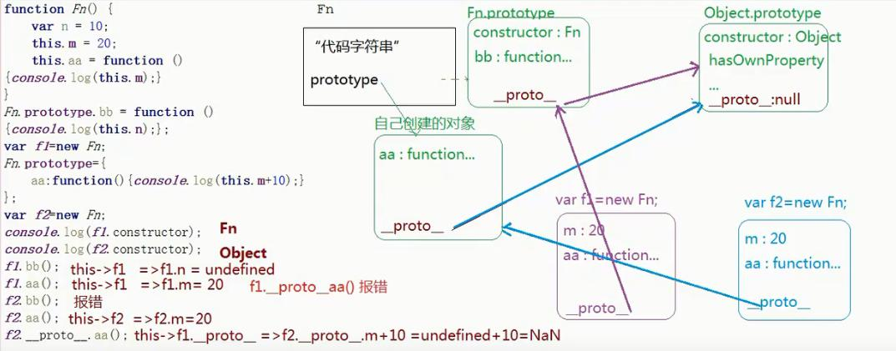
~~~javascript
每个函数都有 prototype 属性，除了 Function.prototype.bind()，该属性指向原型。
每个对象都有 __proto__ 属性，指向了创建该对象的构造函数的原型。
其实这个属性指向了 [[prototype]]，但是 [[prototype]] 是内部属性，我们并不能访问到，所以使用 _proto_ 来访问。
对象可以通过 __proto__ 来寻找不属于该对象的属性，__proto__ 将对象连接起来组成了原型链。
function People(name,age,sex) {
            this.name = name;
            this.age = age;
            this.sex = sex;   
        }
console.log(typeof People.prototype); // 对象
 People.prototype.sayHi = function() {
       alert("大家好,我是"+this.name+"我今年"+this.age+"岁了");
        }//在构造函数的原型上添加方法
//构造函数原型实例的关系
/*                 prototype
          People———————————————>People.prototype
            |                      sayHi()
            | new                    
            |                        ^ 
           people ----------------------| 
                  __proto__  
        */
 // People.prototype 叫做构造函数的原型
 // people 原型的对象	  
  

// 构造函数
        function People(name,age,sex) {
            // {} === this
            this.name = name;
            this.age = age;
            this.sex = sex;
            return 
            // {name:"zs",age:18,sex:"男"}
            /*
              默认不要写return,最后会把这个this对象返回，假如我们手写
              return 返回值是引用类型 则以该引用类型为返回值 其他情况都是
              返回this这个对象
            */
            
            
             // 任何函数天生有一个属性prototype(原型) 该属性值是一个对象
        console.log(typeof People.prototype); // object
        /*
        People.prototype.sayHi = function() {
            alert("大家好，我是"+this.name+",我今年"+this.age);
        }
        //原型链机制
         /*
          obj打点调用sayHi方法 首先在obj对象里查找有没有sayHi方法，假如有
          则执行，没有的话则通过自己的属性__proto__找到自己的原型对象，原型对象
          上有则执行，没有的话继续往自己的原型对象的原型对象上找，以此类推
        
        */
	   
~~~
1. 每一个函数(类)都有一个prototype(原型)属性,属性值是一个对象 这个对象中储存了当前类供实例调取的公有属性和方法
2. 在浏览器默认给原型开辟的堆内存中又一个属性constructor 储存的是当前类本身
3. 每一个对象都有一个__proto__(原型链)属性 这个属性指向当前实例所属类的原型(不确定所属的类 都指向object.prototype)
4. 在实际项目中 基于面向对象开发的时候 (构造和原型设计方式) 我们根据需要 很多时候会重定向类的原型(让类的原型指向自己开辟的堆内存)
**存在的问题**
- 自己开辟的堆内存中 没有constructor属性 导致类的原型构造函数缺失(解决 自己手动解决堆内存中增加constructor属性)
- 当原型重定向后 浏览器默认开辟的原型堆内存会被释放掉 如果之前已经存储了一些方法和属性 这些东西都会丢失(内置类的原型不允许重定向到自己开辟的堆内存 因为内置类原型上自带很多属性和方法 重定向后都没了)
**什么是私有属性?**
自己堆内存中存储的属性 相对自己来说是私有的
**什么是共有属性**
自己基于__proto__找到的属性 相对自己来说是公有的

### new 发生了什么?
新生成了一个对象
链接到原型
绑定 this
返回新对象

### instanceof
instanceof 可以正确的判断对象的类型，因为内部机制是通过判断对象的原型链中是不是能找到类型的 prototype。

### 函数上下文中this代表着什么?
1. 函数如果是圆括号执行 函数上下文就是window 简单来说就是 谁调用我 this就指向谁
2. 函数作为时间处理函数 函数上下文就是这个事件触发的对象
3. 函数作为对象的方法 对象打点调用 那么函数上下文就是这个对象
4. 定时器的this上下文就是window
5. 函数作为数组元素 被索引执行出来 函数上下文就是这个数组

### 箭头函数中this的问题
当函数作为参数传入的时候箭头函数用的比较多

**箭头函数的this引用的是最近作用于中的this
向外层作用域中，一层层查找this 直到有this的定义
**
###改变函数上下文this的指向
call() 也可以调用函数 它的参数除了接受实际参数之外 还可以接受一个参数代表this
appky() 基本功能与call一样 区别在于传递参数的语法不一样 它的参数用数组包裹

### new 调用函数究竟发生了什么事情?
new运算执行函数的时候:
1. 首先函数内部创建一个空对象{}
2. 然后让this指向这个对象
3. 继续往下执行函数体的语句
4. 返回这个函数
~~~javascript
 function People() {
            // 1.{} === 2.this
            this.name = "zhangsan";//3
            this.age = 22;//3
            this.sex = "M";//3
            // this === {name:"zhangsan",age:22,sex:"M"}//4
        }
~~~

### 面向对象编程 OOP Object Oriented Programming
1 js对象
    狭义对象  { } 添加属性 属性可以访问
    广义对象  window 、 Date 、Math
2 基本数据类型与引用数据类型
      基本数据类型 number null undefined string boolean
      基本数据类型不能添加属性 不能拿到属性值
3 json与js狭义对象
     var p1 = {
         "name":"along",
         "age":31
     }  

     json的属性必须加双引号,一般狭义对象不加引号的  
    
     var obj = {
        "~~":"2019",
        "国籍":"china",
        "2018":2018
     }  
====================
计算机语言(程序设计语言)      
    面向对象  js/java/php/c#/python/c++/ruby/...
    面向过程  c
面向对象的相关概念
     对象  万物皆对象 
     类    对象的具体细分（按功能特点进行分类 大类 小类）
     实例  类中一个具体的事物
js是基于面向对象的一门语言
    内置类
                   Object 基类分以下小类                     
一 Number String    Boolean    Null Undefined  Array Date RegExp Function ...
                  
  10  0  -1.2 NaN    
二  HTMLCollection
       元素集合都是其实例

三  EventTarget->子类Node->子类Element->子类HTMLElement->子类HTMLBodyElement->body
   自定义类 
      基于基类，创建更多自己的类


### JS类型

JS中分为七个内置类型，七中内置类型又分为两大类型 基本类型和引用类型（对象）

基本类型 null undefined Boolean number string symbol

其中JS的数字类型是浮点类型的 没有整数 并且浮点类型基于IEEE754标准实现，在使用中会遇到某些Bug

NaN也属于number类型 并且NaN不等于自身

对于基本类型来说 如果使用字面量的方式 那么这个变量只是个字面量 只有在必要的时候才会转为对应的类型

~~~
let a = 111 // 这只是字面量，不是 number 类型
a.toString() // 使用时候才会转换为对象类型
~~~


~~~
//1 作用域值引用
    var num1=55;
    var num2=66;
    function f1(num,num1) {
        //形参num与num1 先声明 是局部变量
        //var num,num1 然后 55，66分别传进来
        num=100;//55的值改为66
        num1=100; //66的值改为100
        num2=100; //全局变量
        console.log(num);//100
        console.log(num1);//100
        console.log(num2);//100
        
    }
    f1(num1,num2);//第一步全局变量num1与num2的值赋值进去 f1(55,66)
    console.log(num1);//55
    console.log(num2);//100
    console.log(num);//外面无法访问里面的 未声明  出错
~~~


~~~
    //作用域引用类型
function Person(name,age,salary) {
    this.name=name;
    this.age=age;
    this.salary=salary;
}
function f1(person) {
    //var person={
    //name='zs'
    //age=18
    //salary=1000
    //}
    //p和person指向同一个对象
    person.name='ls';//person更改名字后 p的name也是ls
    person=new Person('aa',18,10);
}

var p=new Person('zs',18,1000)
console.log(p.name);//zs
f1(p);
//person new了之后重新指向另一个对象 但是和p没有关系
console.log(p.name);//ls
~~~


in:检测某一个属性是否隶属于这个对象(不管是私有属性还是共有属性,只要有这个属性结果就是true)
hasOwnProperty:检测某一个属性是否为对象的私有属性(只有这个属性是私有的才可以)

在js非严格模式下 函数中的形参变量和arguments存在映射机制(映射:相互之间影响)